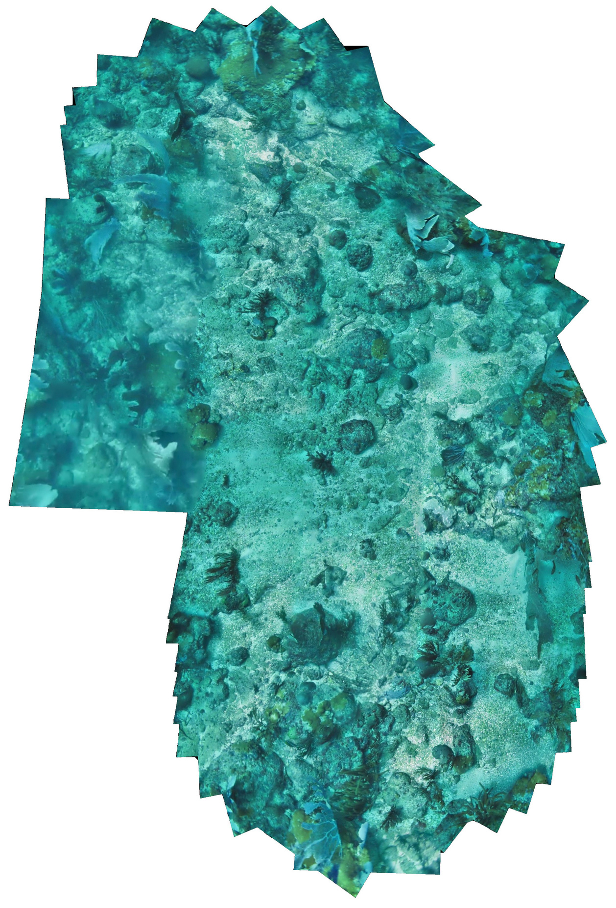
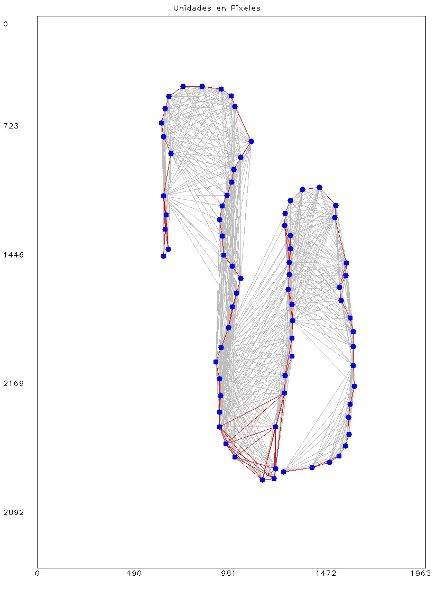
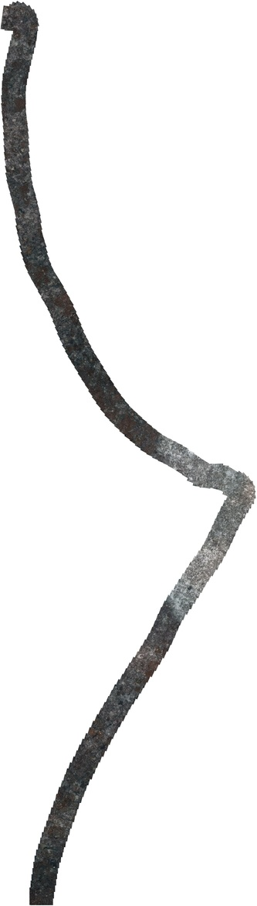
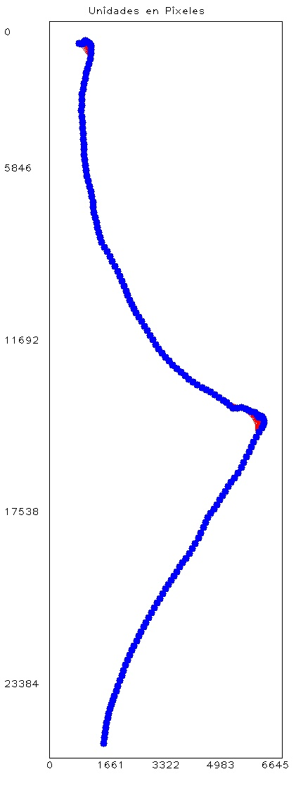

# Automated Video Mosaic

Monocular video based Mosaic Generation System for mobile robots.
Currently under development as part of undergrad project of Víctor García

**mosaic** is a free and open source software licensed under the [GNU GPLv3.0 License](https://en.wikipedia.org/wiki/GNU_General_Public_License), unless otherwise specified in particular modules or libraries (see LICENSE and README.md).

## Table of Contents
- [Modules list](#modules-list)
- [Requirements](#requirements)
- [Getting Started](#getting-started)
- [Software details](#software-details)
- [Contributing](#contributing)
- [License](#license)

## Modules list
- [core](https://github.com/MecatronicaUSB/mosaic/tree/master/core) Main project for automated mosaic build (Results, usage examples, build tutorial).
- [fcomp](https://github.com/MecatronicaUSB/mosaic/tree/master/modules/fcomp) Feature extractors and matchers comparison (extractors: SIFT, SURF, ORB, KAZE. matchers: Brute force, Flann)
- [stitch](https://github.com/MecatronicaUSB/mosaic/tree/master/modules/stitch) Image warping and stitching

Each module contains information describing its usage, with (usually) some useful README file. Code documentation is expected to be provided in Doxygen-compatible format. The current release contains C/C++ implementation.

## Directory Layout

     ├── src             # source files
          └── ...
     ├── include         # header files
          └── ...  
    ├── modules
     \ ├── fcomp           # module for festure extractor comparison
          ├── src          # source files
          ├── include      # header files
          └── ...          
     \ ├── stitch          # module for image stitching
          ├── src          # source files
          ├── include      # header files
          └── ...

## Requirements

The current release has been developed and tested in Ubuntu 16.04 LTS 64 bits

- [OpenCV 4.2+](http://opencv.org) and extra modules (OpenCV contrib).
- [cmake 3.1X](https://cmake.org/) - cmake making it happen again

CUDA support is available (still in beta)

## Getting Started

To start using this project, proceed to the standard *clone* procedure:

```bash
cd <some_directory>
git clone https://github.com/MecatronicaUSB/mosaic.git
```

## How to compile?
Provided with this module, there is a CMakeLists.txt file, which you can use to directly compile the code as follows:
```bash
cd <mosaic-opencv_directory>
mkdir build
cd build
cmake ..
make
```

If you want to enable (still in beta) CUDA support, please add the *USE_CUDA* flag when invoking cmake:
```bash
cmake -DUSE_CUDA=1 ..
```

## How to run?
### Input data considerations
The input data must be a folder path containing at least two temporal consecutive frames, 
with at least 30% of overlap area between them.

### Run
After compilation, run the program with the following syntax:
```bash
./mosaic [INPUT DIRECTORY] [OUTPUT DIRECTORY] {OPTIONS}
```
To see detailed usage information, enter the following command:
```bash
./mosaic -h
```
### Usage examples:
```bash
./mosaic /home/data/<path-of-frames> /home/data/<output-path> -o -g -n 3
```
The above code will build a mosaic using perspective transformations, 
to find the best seam line a graph cut algorithm wil be used, then a multiband blender with 3 bands will be applied.
Finally the resulting mosaic will be shown.

```bash
./mosaic /home/data/<path-of-frames> /home/data/<output-path> -e --sift --bf --scb
```
The above code will build a mosaic using euclidean transformations, the SCB algorithm will be applied on each frame to 
enhance final mosaic view, SIFT detector and BruteForce matcher are used.

In both cases the resulting mosaic and track map will be saved in the provided outpt path.

# Results
### Test using:
- Graph cut seam finder.
- multiband blender with five bands.
- CLAHE (in BGR).
- 87 images input.
- Perspective transformations.

<p align="center">
  
  
</p>
- Lef. Final Mosaic.<br />
- Right. Final Map.<br />

### Test using:
ScottReef 25 dataset from ACFR.
- 177 Images input.
- Euclidean transformations.

<p align="center">
  
  
</p>
- Left. Mosaic in BGR.<br />
- Right. Mosaic map, in pixels.<br />


## Contributing

Summary of contributing guidelines (based on those of OpenCV project):

* One pull request per issue;
* Choose the right base branch;
* Include tests and documentation;
* Use small datasets for testing purposes;
* Follow always the same coding style guide. If possible, apply code formating with any IDE.

## License

Copyright (c) 2017-2018 Grupo de Investigación y Desarrollo en Mecatrónica (<mecatronica@usb.ve>).
Released under the [GNU GPLv3.0 License](LICENSE). 
